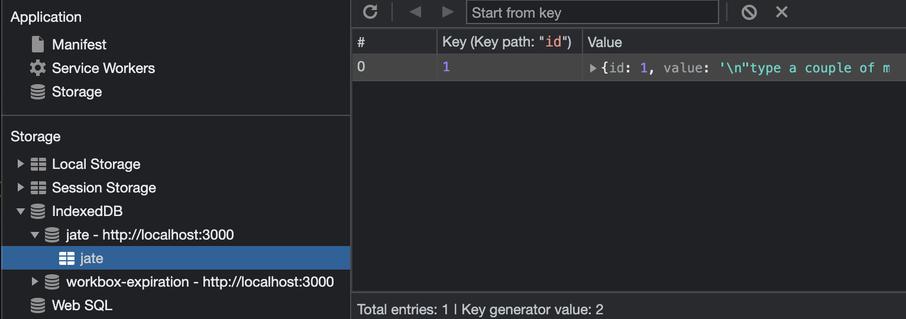
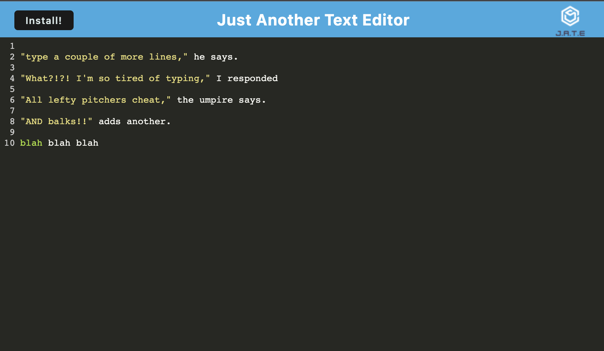
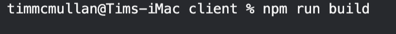
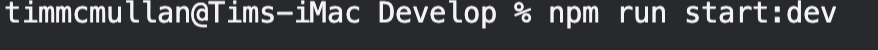
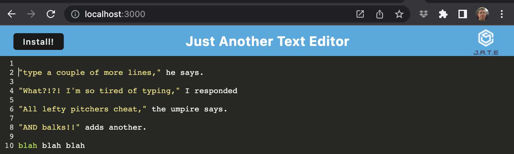

# HW_19_PWA_Text_Editor

## Just what we need !!
Just Another Text Editor (JATE) is exactly what it sounds like; another place to put text.  However, this one comes in a web page OR as a stand alone app, and it will save your progress if there is a service (wifi, power, etc) interruption.

## Table of Contents

- [Summary](#Summary)
- [Technology Used](#technology-used)
- [Shoutouts and Credits](#shoutouts)
- [Features](#features)
- [Instructions](#instructions)

## Summary
This application is the first built as a Progressive Web Application (PWA), which makes it deployable to end users.  This requires coordination between the files required to conduct the functions of the app and the software required to deploy that app.

## Technology Used
The app itself, and the deployment, requires certain packaging.  We've been using Node.js and a few technologies in previous apps.  The big leap in this one is the use of Webpack, and the technology is almost involved when it comes to the integration.  When it comes together, it's a beautiful thing!

## Shoutouts
Both Veronica and Don were huge helps with this project.  Of course, Captain John steers the ship and drives the crew. From their taken-for-granted assistance throughout the day in facilitating the class and answering our questions, to the more detail and focus they infuse during office hours, this project would not have come into focus without their efforts.  Personally, I have Andy and Jim who are huge beneficiaries to my work.  They are on-call resources who help focus my attention in the right area.

## Features
Other than being a text editor and an installable app, we feature auto-save to local storage.  Here you can see the indexdb (jate) being used to store data.

## Instructions
Check the links below to the deployed app.  Once there, a user can use the INSTALL button in the upper left corner to install the app on their device.  Whether the user deploys and initiates the app, or simply uses the features in the web page, the operation is the same.  Type what you like.  Leave if you need to leave and we'll save your progress.  Lose focus on your text, and we'll make sure your efforts are not lost.

### To install on your local device
Simply click on the INSTALL button in the upper left of the app.

### Full install from command line
Navigate to the root directory and run: npm i

Navigate to the client directory and run: npm run build

Navigate to the server directory and run: npm run start:dev

Launch a browser, click on the URL bar and type: 'LOCAL HOST:3000'

## Links
[Tim's github link][github_link]

[This app's deployed link][heroku_link]

[Tim's email address][tims_email]

[github_link]: https://www.github.com/TimMcMullan
[heroku_link]: https://git.heroku.com/homework-19-progressivewebapps.git
[tims_email]: mailto:mcmullant@gmail.com
mcmullant@gmail.com
